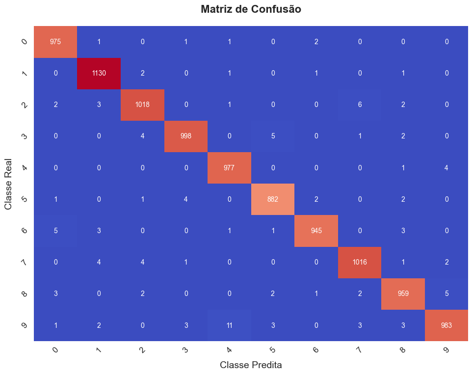
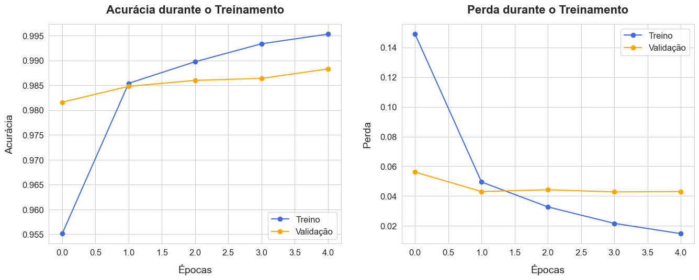

<h1>Cálculo de Métricas de Avaliação de Aprendizado</h1>

<h4>Repositório criado para o desafio do bootcamp BairesDev - Machine Learning Practitioner</h4>

    Este projeto implementa um modelo de aprendizado profundo utilizando a biblioteca TensorFlow e o dataset MNIST. Além de treinar e avaliar o modelo, são calculadas e visualizadas as principais métricas de avaliação de classificação, como acurácia, sensibilidade, especificidade, precisão e F1-Score.

<h3>🧠 Objetivo</h3>

    Demonstrar como construir um modelo de aprendizado profundo simples e calcular métricas essenciais para a avaliação de métodos de classificação. O projeto também foca na apresentação gráfica dessas métricas de maneira clara e esteticamente agradável.

<h2>📂 Estrutura do Projeto</h2>
<ul>
    <li><b>Pré-processamento de Dados:</b> Normalização e reformatamento das imagens do MNIST.
    <li><b>Construção do Modelo:</b> Rede neural convolucional com camadas <code>Conv2D</code>, <code>MaxPooling2D</code>, e <code>Dense</code>.
    <li><b>Treinamento:</b> Treinamento e validação do modelo.
    <li><b>Cálculo de Métricas:</b>
        <ul>
            <li>Matriz de Confusão
            <li>Relatório de Classificação (precisão, recall, F1-score)
        </ul>
    <li><b>Visualização Gráfica:</b>
        <ul>
            <li>Matriz de confusão estilizada.
            <li>Curvas de Acurácia e Perda durante o treinamento.
        </ul>
</ul>

<h2>🛠️ Tecnologias Utilizadas</h2>
<ul>
    <li><b>Python</b>
    <li><b>Bibliotecas:</b>
    <ul>
        <li><code>tensorflow.keras</code>: Construção e treinamento do modelo.
        <li><code>numpy</code> e <code>pandas</code>: Manipulação de dados.
        <li><code>matplotlib.pyplot</code> e <code>seaborn</code>: Visualizações gráficas.
        <li><code>sklearn.metrics</code>: Cálculo de métricas.
    </ul>
</ul>

<h2>📊 Métricas Calculadas</h2>
<table>
        <thead>
            <tr>
                <th>Métrica</th>
                <th>Fórmula</th>
                <th>Descrição</th>
            </tr>
        </thead>
        <tbody>
            <tr>
                <td>Sensibilidade</td>
                <td>VP / (VP + FN)</td>
                <td>Taxa de verdadeiros positivos entre todos os positivos reais.</td>
            </tr>
            <tr>
                <td>Especificidade</td>
                <td>VN / (VN + FP)</td>
                <td>Taxa de verdadeiros negativos entre todos os negativos reais.</td>
            </tr>
            <tr>
                <td>Acurácia</td>
                <td>(VP + VN) / N</td>
                <td>Proporção de predições corretas.</td>
            </tr>
            <tr>
                <td>Precisão</td>
                <td>VP / (VP + FP)</td>
                <td>Taxa de verdadeiros positivos entre todos os positivos preditos.</td>
            </tr>
            <tr>
                <td>F1-Score</td>
                <td>2 × (P × S) / (P + S)</td>
                <td>Média harmônica entre precisão e sensibilidade.</td>
            </tr>
        </tbody>
    </table>

<h2>📈 Visualizações</h2>
<h3>Matriz de Confusão</h3>

A matriz de confusão é apresentada com uma coloração otimizada e rótulos claros para facilitar a análise das predições.

<h3>Curvas de Acurácia e Perda</h3>

Gráficos que mostram a evolução da acurácia e da perda durante as épocas de treinamento e validação.

<h2>🔍 Exemplos de Saída</h2>
<h3>Matriz de Confusão</h3>

<h3>Curvas de Acurácia e Perda</h3>

<h2>📜 Licença</h2>

Este projeto é licenciado sob a licença <a href="https://opensource.org/licenses/MIT">MIT</a>.

<h2>📬 Contato</h2>

  
  

